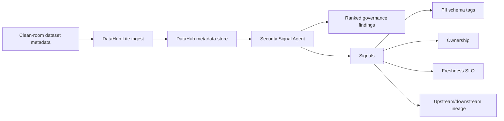

# Architecture

## Read-only flow

The prototype is intentionally read-only. It ingests synthetic metadata, queries DataHub Lite, and computes one deterministic security/governance signal. The final upgrade path is to replace the Lite read calls with official DataHub MCP Server or Agent Context Kit tools once a full DataHub backend is available.

## Current backend

DataHub Lite is used for this spike because it works without Docker, cloud setup, credentials, or spend. It exposes enough metadata for the proof: entity list, schema fields, tags, ownership, freshness custom properties, and lineage aspects.

See [full_backend_attempt.md](full_backend_attempt.md) for the attempted full DataHub quickstart and why it was stopped on this machine.

## Production upgrade path

1. Run full DataHub or use a valid DataHub backend token.
2. Switch the agent read calls to official `mcp-server-datahub` / `datahub-agent-context` tools.
3. Add a write-back option that creates a DataHub document, tag, or ownership task for accepted findings.
4. Keep mutation tools opt-in and clearly separated from read-only scoring.
